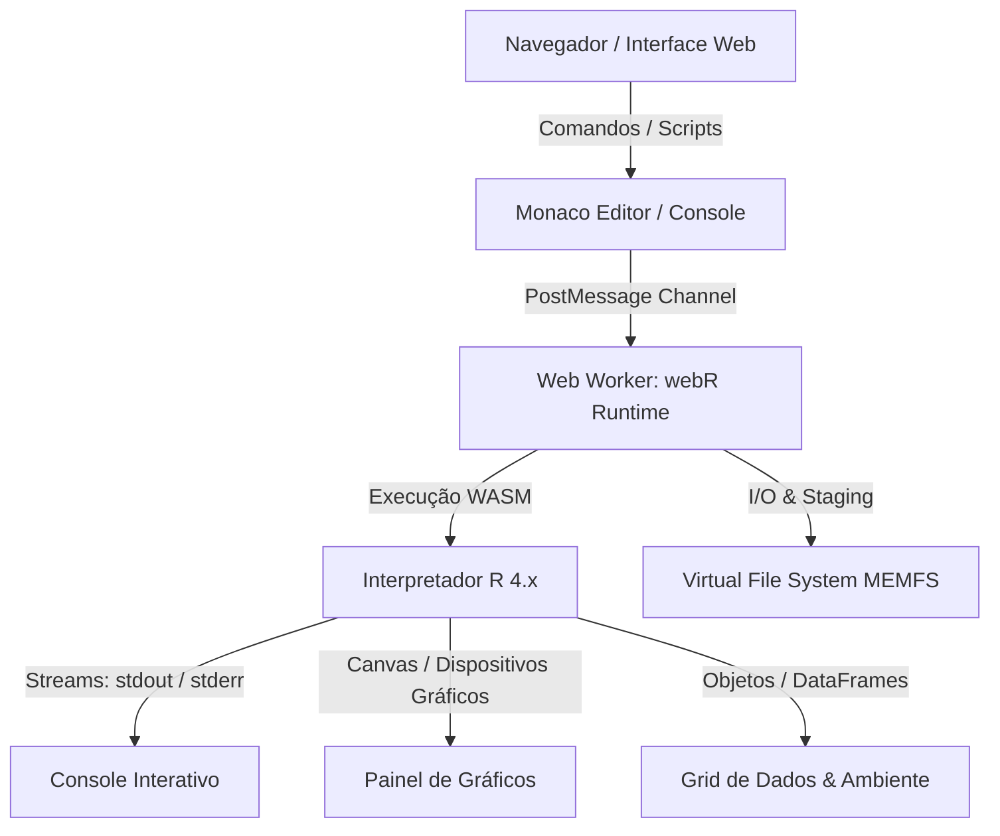

# Documentação Técnica — webR Station

## 1. Visão Geral
O **webR Station** é um projeto **open source**, **100% gratuito e livre para todos**, desenvolvido exclusivamente para **finalidade de estudo, pesquisa e uso não comercial**. Ele fornece um ambiente de análise de dados e IDE interativa para a linguagem **R** executada inteiramente no navegador (*client-side*) via **WebAssembly (WASM)**, eliminando a necessidade de instalação local do R ou de servidores remotos.

---

## 2. Arquitetura do Sistema



### Componentes Chave
1. **Runtime WebAssembly:** Instância oficial do interpretador R compilada para WebAssembly ([webR](https://docs.r-wasm.org/webr/latest/)) isolada em um Web Worker para não bloquear a UI.
2. **Sistema de Arquivos Virtual (VFS):** Montado em `/home/web_user/` (Emscripten MEMFS), com diretório dedicado para upload e manipulação em `/home/web_user/uploads/`.
3. **Editor de Código:** Monaco Editor com realce de sintaxe R, autocompletion e atalhos (`Ctrl+Enter` para execução de linha/seleção).

---

## 3. Módulos do Sistema (`config/`)

| Módulo | Arquivo | Responsabilidade Técnica |
| :--- | :--- | :--- |
| **Workstation** | [`webr-workstation.js`](file:///c:/Users/lukzb/Projects/webr/config/webr-workstation.js) | Inicialização do canal webR, upload/staging de arquivos via Drag & Drop no VFS. |
| **Sessão** | [`webr-session.js`](file:///c:/Users/lukzb/Projects/webr/config/webr-session.js) | Gerenciamento de abas de script, serialização e restauração de sessões (`.webr-project`). |
| **Análise & Grid** | [`webr-analysis.js`](file:///c:/Users/lukzb/Projects/webr/config/webr-analysis.js) | Visualizador de DataFrames com paginação, ordenação, filtro por coluna e assistente CSV/XLSX. |
| **Pacotes** | [`webr-packages.js`](file:///c:/Users/lukzb/Projects/webr/config/webr-packages.js) | Catálogo e instalação de pacotes binários WASM via repositório r-wasm (`webr::install`). |
| **Gráficos** | [`webr-plot-style.js`](file:///c:/Users/lukzb/Projects/webr/config/webr-plot-style.js) | Captura de plots em canvas/SVG, histórico em carrossel e exportação em alta resolução (72–600 DPI). |
| **Produtividade** | [`webr-productivity.js`](file:///c:/Users/lukzb/Projects/webr/config/webr-productivity.js) | Paleta de comandos rápida (`Ctrl+K`), biblioteca de snippets e atalhos de teclado. |
| **Navegação & UI** | [`ui-nav.js`](file:///c:/Users/lukzb/Projects/webr/config/ui-nav.js), [`webr-header.js`](file:///c:/Users/lukzb/Projects/webr/config/webr-header.js) | Controle de abas, layout responsivo e alternância de temas (claro/escuro). |

---

## 4. Fluxo de Dados e Execução

1. **Inicialização:** A página carrega os assets estáticos e dispara o bootstrap do webR em worker assíncrono.
2. **Entrada de Código:** Usuário escreve no Monaco Editor ou na CLI do console.
3. **Avaliação Assíncrona:** A chamada `webR.evalR()` ou `webR.evalRVoid()` despacha o código via `post-message`.
4. **Manipulação de Arquivos:** Arquivos enviados pelo usuário são convertidos em `Uint8Array` e gravados via `webR.FS.writeFile` em `/home/web_user/uploads/`.
5. **Renderização de Resultados:**
   - **Textual:** Capturado via listeners de saída e injetado no DOM do console.
   - **Gráfica:** Renderizado no elemento `<canvas>` ou vetor SVG e arquivado no histórico de plots.
   - **Tabelas:** Objetos tabulares são extraídos em JSON e injetados no grid interativo.

---

## 5. Execução Local e Deploy

Por ser uma aplicação 100% estática, não requer compilação de backend:

```bash
# Executar localmente com Node.js:
npx serve . -p 3000

# Ou com Python:
python -m http.server 3000
```

- **Deploy:** Compatível diretamente com GitHub Pages, Vercel, Netlify ou qualquer servidor HTTP estático (garantindo a presença do arquivo [`.nojekyll`](./.nojekyll)).

---

## 6. Documentação Detalhada

Para acessar os manuais completos e referências técnicas aprofundadas, consulte a pasta [`docs/`](./docs/):

- 📖 **[Central de Documentação (Hub)](./docs/README.md)**
- 👤 **[Guia do Usuário](./docs/guia-do-usuario.md)**
- 🏗️ **[Guia de Arquitetura](./docs/arquitetura.md)**
- 🔌 **[Referência de Módulos & APIs](./docs/referencia-modulos.md)**
- 💻 **[Desenvolvimento & Contribuição](./docs/desenvolvimento-e-contribuicao.md)**
- 🚀 **[Deploy & Publicação](./docs/deploy-e-publicacao.md)**
- ❓ **[FAQ & Solução de Problemas](./docs/faq-e-solucao-de-problemas.md)**
- 🗺️ **[Plano de Implementação de Recursos Avançados](./docs/superpowers/plans/2026-08-19-plano-recursos-avancados-webr.md)**

---

## 7. Licença, Atribuição & Finalidade de Estudo

Este projeto é **Open Source** distribuído sob a licença **MIT** (consulte o arquivo [`LICENSE`](./LICENSE)).

### ⚖️ Atribuição e Créditos dos Projetos Originais:
- **Motor Original R (webR):** Desenvolvido por **George Stagg** e mantido pela equipe da **Posit Software, PBC** ([https://webr.r-wasm.org](https://webr.r-wasm.org) / [GitHub r-wasm/webr](https://github.com/r-wasm/webr)). Todos os direitos do core e compilador WebAssembly pertencem aos seus respectivos autores originais.
- **Monaco Editor:** Desenvolvido pela **Microsoft Corporation** ([GitHub microsoft/monaco-editor](https://github.com/microsoft/monaco-editor)).
- **quarto-webr:** Desenvolvido por **James Joseph Balamuta (coatless)** ([GitHub coatless/quarto-webr](https://github.com/coatless/quarto-webr)).

> **Nota de Uso:** Este repositório consiste em customizações de **interface, layout, usabilidade e documentação**, com finalidade estritamente **educacional, científica e não comercial**, livre e gratuito para uso da comunidade.


