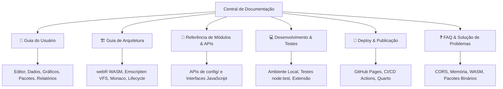

# 📚 Central de Documentação — RStation Web

Bem-vindo à documentação oficial do **RStation Web**, uma estação de desenvolvimento e análise científica de dados que executa a linguagem **R 100% no navegador** via WebAssembly (**webR**), equipada com o editor de código **Monaco**, sistema de arquivos virtual (VFS), visualizador de dados interativo, editor visual de estilo de gráficos e ferramentas avançadas de produtividade e compartilhamento.

---

## 🗺️ Mapa da Documentação

A documentação está organizada de forma modular para atender tanto a usuários finais (pesquisadores, estudantes, analistas de dados) quanto a desenvolvedores e mantenedores:

---

## 📑 Índice de Documentos

| Documento | Descrição | Público Alvo |
| :--- | :--- | :--- |
| **[Guia do Usuário](./guia-do-usuario.md)** | Manual completo de uso: tour pela interface, atalhos do editor, importador inteligente de dados (CSV/Excel/Nuvem), Data Grid, edição de gráficos, pacotes e exportação de relatórios. | Usuários Finais, Cientistas de Dados, Pesquisadores |
| **[Guia de Arquitetura](./arquitetura.md)** | Detalhamento da engenharia de software: funcionamento do motor WebAssembly, VFS Emscripten, integração com Monaco Editor, pipeline de dados R-JS e gerenciamento de estado. | Desenvolvedores, Arquitetos de Software |
| **[Referência de Módulos & APIs](./referencia-modulos.md)** | Especificação de cada módulo JavaScript (`webr-analysis.js`, `webr-plot-style.js`, `webr-packages.js`, `webr-session.js`, etc.), contratos e métodos globais. | Desenvolvedores |
| **[Desenvolvimento & Contribuição](./desenvolvimento-e-contribuicao.md)** | Instruções para rodar localmente, padrões de código, adição de novos snippets/pacotes e execução da suíte de testes com `node:test`. | Colaboradores e Mantenedores |
| **[Deploy & Publicação](./deploy-e-publicacao.md)** | Guia de publicação no GitHub Pages via GitHub Actions ou branch estática, suporte Quarto e cabeçalhos de segurança. | Mantenedores, DevOps |
| **[FAQ & Solução de Problemas](./faq-e-solucao-de-problemas.md)** | Respostas para dúvidas frequentes, diagnóstico de erros de execução no console, limitações de pacotes no WASM e problemas de CORS. | Todos os públicos |
| **[Plano de Recursos Avançados](./superpowers/plans/2026-08-19-plano-recursos-avancados-webr.md)** | Planejamento técnico para implementação de `webR.interrupt()`, `IDBFS`, `WORKERFS`, `RObject.destroy()`, Service Worker e `readline()`. | Desenvolvedores, Mantenedores |

---

## ⚡ Visão Rápida dos Recursos

- **Zero Instalação:** O interpretador oficial do R é baixado e executado diretamente pelo navegador via WebAssembly.
- **Editor Monaco Integrado:** Suporte a realce de sintaxe R, autocompletion, atalhos padrão do RStudio (`Ctrl+Enter` / `Cmd+Enter`) e múltiplas abas de script com exportação para ZIP.
- **Assistente Inteligente de Importação:** Upload local por arrastar e soltar (drag & drop), detecção automática de encoding (UTF-8 vs Windows-1252), separador e decimal de CSV, além de importador de planilhas Excel (`.xlsx`) e conexão em nuvem (Google Sheets e GitHub Raw).
- **Data Grid & Skim:** Tabela interativa com paginação, ordenação, busca em colunas, diagnóstico de valores ausentes (`NA`) e conversão dinâmica de tipos de dados.
- **Galeria & Editor de Estilo de Gráficos:** Captura instantânea de saídas gráficas em alta resolução (até 600 DPI / SVG vetorial), histórico com miniaturas e ajuste visual interativo de cores, símbolos (`pch`), tipos de linha (`lty`), legendas e tamanhos com injeção automática no código R.
- **Snippets & Paleta de Comandos (`Ctrl+K`):** Acesso rápido a dezenas de receitas de código prontas (Tidyverse, Estatística, Modelagem, ggplot2, Bioestatística/Ecologia).
- **Reprodutibilidade & Relatórios:** Compartilhamento direto por link comprimido na URL (`#code=...`), salvamento de sessão completa (`.webr-project`) e geração de relatórios estáticos em PDF e HTML.

---

## 👥 Autoria & Créditos

- **Modificações de Interface, Layout & Documentação:** **Lucas Batista Vargas** ([@batistalucasv](https://github.com/batistalucasv))
- **Finalidade:** Projeto **Open Source**, 100% gratuito e livre, com fins exclusivos de **estudo, pesquisa e uso não comercial**.
- **Tecnologias Base e Autores Originais:**
  - **[webR Oficial (r-wasm)](https://webr.r-wasm.org)** — George Stagg & Posit PBC ([GitHub r-wasm/webr](https://github.com/r-wasm/webr))
  - **[quarto-webr](https://github.com/coatless/quarto-webr)** — James Joseph Balamuta (coatless)
  - **[Monaco Editor](https://microsoft.github.io/monaco-editor/)** — Microsoft Corporation
  - **[Quarto](https://quarto.org/)** — Posit PBC

---

## 📄 Licença

Distribuído sob a licença **MIT**, preservando integralmente os direitos e avisos de copyright dos autores originais. Consulte o arquivo [`LICENSE`](../LICENSE) para mais detalhes.

