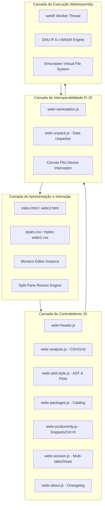
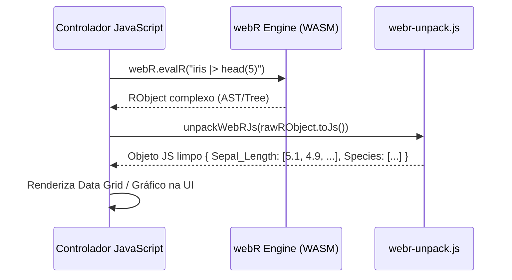
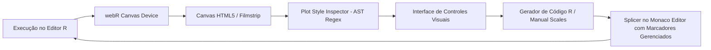

# 🏗️ Guia de Arquitetura — RStation Web

Este documento detalha as decisões arquiteturais, fluxos de dados, subsistemas e tecnologias que compõem a estação **RStation Web**.

---

## 🎯 1. Princípios Arquiteturais

1. **Zero-Backend (100% Client-Side):** Todo o processamento estatístico, computacional e gráfico é executado no navegador do usuário via WebAssembly (WASM). Nenhum dado do usuário ou script é enviado para servidores remotos para processamento.
2. **Privacidade por Design (Privacy-by-Design):** Dados sensíveis, arquivos CSV e scripts permanecem estritamente confidenciais na memória do cliente.
3. **Ergonomia e Alto Desempenho:** Interface construída em Vanilla JavaScript e CSS customizado de alto desempenho, eliminando sobrecargas de frameworks pesados e garantindo renderizações a 60 FPS.
4. **Modularidade e Baixo Acoplamento:** Módulos independentes com padrão IIFE e injeção de dependências (`config/webr-*.js`), com interfaces bem definidas para comunicação entre componentes.

---

## 🏛️ 2. Visão Geral da Arquitetura em Camadas



---

## ⚙️ 3. Subsistemas Principais

### 3.1. Motor WebAssembly (`@r-wasm/webr`)
O coração do RStation Web é o interpretador oficial da linguagem R compilado para WebAssembly via Emscripten:
- **Thread Isolada (Web Worker):** O webR executa em uma thread separada via Web Worker, impedindo que cálculos estatísticos pesados travem a interface gráfica principal (UI thread).
- **Canais de Comunicação (Communication Channels):** Utiliza `PostMessage` ou `SharedArrayBuffer` para troca assíncrona de mensagens, entrada/saída de texto e eventos de renderização.

### 3.2. Sistema de Arquivos Virtual (Emscripten VFS)
O webR emula um sistema de arquivos POSIX completo em memória:
- **Ponto de Montagem Padrão:** `/home/web_user/`
- **Diretório de Uploads:** `/home/web_user/uploads/`
- **Operações de Arquivo:** A gravação e leitura de arquivos do usuário ocorrem via chamadas de baixo nível (`webR.FS.writeFile`, `webR.FS.readFile`, `webR.FS.mkdir`).
- **Ciclo de Vida:** O VFS reside na memória RAM do navegador durante a sessão.

### 3.3. Interoperabilidade e Desempacotamento de Dados (`webr-unpack.js`)
Quando o R retorna estruturas complexas (`data.frame`, `matrix`, listas nomeadas, vetores atômicos com nomes), a serialização padrão `RObject.toJs()` do webR produz árvores profundas com metadados internos de tipo (`type`, `names`, `values`).

O módulo [`webr-unpack.js`](file:///config/webr-unpack.js) fornece um parser resiliente que converte estruturas nativas do R em objetos JavaScript legíveis, preservando:
- Vetores de colunas e nomes de DataFrames.
- Colunas com apenas 1 linha como arrays unidimensionais.
- Valores atômicos e conversão de `NA` para `null`.
- Captura estruturada de payloads de erro e mensagens do sistema R.



---

## 🎨 4. Pipeline de Gráficos e Editor de Estilo (`webr-plot-style.js`)

A renderização gráfica e o editor visual de estilo operam através de um pipeline bidirecional:



### Mecanismo de Splicing de Código:
1. **Inspeção de Sintaxe (AST/Regex):** O módulo inspeciona o código do editor para detectar se o gráfico ativo é **ggplot2** ou **Base R** (`detectPlotKind`).
2. **Extração de Argumentos:** Extrai chamadas existentes como `col = c(...)`, `pch = ...`, `legend(...)`, `cex = ...` ou `scale_colour_manual(...)`.
3. **Injeção Não-Destrutiva:** O gerador injeta ou substitui as customizações exclusivamente dentro do bloco gerenciado delimitado por:
   ```r
   # --- webr-plot-style ---
   scale_colour_manual(values = c(setosa = "#276DC3", versicolor = "#2EA043")) +
   theme(legend.position = "bottom")
   # --- /webr-plot-style ---
   ```
4. **Preservação de Código:** Comentários, análises estatísticas e cálculos ao redor do bloco gráfico são rigorosamente preservados.

---

## 💾 5. Gerenciamento de Estado e Persistência

O RStation Web utiliza estratégias especializadas para persistência de estado e compartilhamento:

| Dado | Mecanismo de Armazenamento | Chave / Formato |
| :--- | :--- | :--- |
| **Tema (Dark/Light)** | `localStorage` | `webr-theme` |
| **Idioma (pt-BR / en-US)** | `localStorage` | `webr2-lang` |
| **Divisão do Split-Pane** | `localStorage` | `webr-split-ratio` (0.2 – 0.8) |
| **Chaves de API de IA (Copilot)** | `localStorage` | `webrtest-ai-key-*` |
| **Compartilhamento de Scripts** | URL Hash (Comprimido) | `#code=...` (Algoritmo LZ-String) |
| **Sessão Completa** | Arquivo JSON (`.webr-project`) | Estrutura contendo lista de abas, nomes de scripts, códigos, timestamps e metadados. |

---

## 🔒 6. Segurança e Isolamento de Origem

- **Políticas de CSP e CORS:** Como todo o código R roda no cliente, o consumo de recursos externos (ex: CSVs remotos) está sujeito à política de Mesma Origem (Same-Origin Policy).
- **Sem Risco de RCE no Servidor:** Execução de código arbitrário pelo usuário é confinada dentro do sandbox WebAssembly no navegador do próprio usuário, tornando o sistema imune a vulnerabilidades clássicas de Remote Code Execution em servidores.
