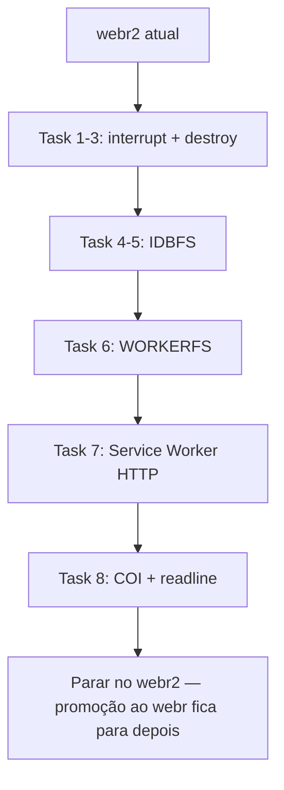

# webr2 — Advanced webR Runtime Implementation Plan

> **Status:** Plan only. Do **not** start implementation until Lucas asks. This plan is the webr2 sandbox, not production webr.
>
> **For agentic workers:** REQUIRED SUB-SKILL: Use superpowers:subagent-driven-development (recommended) or superpowers:executing-plans to implement this plan task-by-task. Steps use checkbox (`- [ ]`) syntax for tracking. Do not execute until Lucas says to implement **on webr2**.

**Goal:** On the **webr2** test station only, integrate webR v0.6.0+ runtime features (interrupt, RObject.destroy, IDBFS, WORKERFS, network service worker, COOP/COEP + readline) without breaking Monaco / Shelter.captureR / upload / packages.

**Architecture:** A small ES module `webr2-runtime.js` owns pure helpers (thresholds, path constants, destroy wrapper, interrupt/error classification, upload routing, persist sync flags). `webr2.html` wires UI and calls `webR.interrupt()`, `webR.FS.mount`, and a same-origin service worker named for the sandbox. Production webr (`index.html`, `styles.css`, `config/`, `dist/`) is out of scope. Promotion is a later product decision, only if the sandbox proves useful and stable.

**Tech Stack:** Vanilla ES modules, Node `node:test`, webR 0.6.0 (`https://webr.r-wasm.org/v0.6.0/webr.mjs`), Emscripten MEMFS / IDBFS / WORKERFS, GitHub Pages static hosting.

## Global Constraints

- **webr2 only.** Touch `webr2.html`, `styles-webr2.css`, `webr2-runtime.js`, `webr2-serviceworker.js`, `webr2-coi-serviceworker.js`, and `tests/webr2-runtime.test.mjs`. Never modify production `index.html`, `styles.css`, `src/`, `config/`, or `dist/`.
- **Do not promote to webr in this plan.** If a feature later looks useful and stable, Lucas may ask to port it. That is a new piece of work, not a task here.
- Product name in UI: **RStation Web**. Engine credit may still say webR.
- webR CDN: `https://webr.r-wasm.org/v0.6.0/webr.mjs` (do not bump unless Lucas asks).
- Helper module: `webr2-runtime.js`. `webr2.html` imports `./webr2-runtime.js`.
- Tests: `node --test tests/webr2-runtime.test.mjs` (gitignored with other webr2 artifacts). No WASM in unit tests.
- No new npm dependencies. Vendor service-worker files with webr2 names (same origin, gitignored).
- UI copy: Brazilian Portuguese.
- Do not rewrite `runRCode` Shelter.captureR graphics pipeline. Interrupt runs **alongside** it.
- `webR.interrupt()` only aborts work when the channel supports Atomics (`SharedArrayBuffer`). Until Task 8, the Interromper button still calls `interrupt()` and shows a clear console line if the engine cannot abort.
- `LARGE_FILE_BYTES` is exactly `20 * 1024 * 1024`. Below: MEMFS write to `/home/web_user/uploads`. At/above: WORKERFS mount at `/mnt/files`.
- Persist dir: `/home/web_user/workspace`. Upload dir stays `/home/web_user/uploads`.
- webr2 artifacts are gitignored. Skip `git add` / `git commit` for every task in this plan (`webr2*`, `styles-webr2*`, `tests/webr2*`). Do not `git add -f`.



## File Structure

| File | Responsibility |
|---|---|
| `webr2-runtime.js` | Pure helpers: paths, `withRObject`, interrupt error text, upload target, persist helpers. ES module. |
| `tests/webr2-runtime.test.mjs` | Node tests for those helpers (no DOM, no WASM). Gitignored. |
| `webr2.html` | Sandbox UI: interrupt, persist badge, readline, `new WebR({...})`, upload routing. |
| `styles-webr2.css` | Interrupt button, persist badge, readline bar. |
| `webr2-serviceworker.js` | Official webR v0.6.0 service worker, vendored for the sandbox origin. |
| `webr2-coi-serviceworker.js` | COOP/COEP shim, vendored for webr2 only. |

---

### Task 1: Runtime helper module (destroy + routing)

**Files:**
- Create: `webr2-runtime.js`
- Test: `tests/webr2-runtime.test.mjs`

**Interfaces:**
- Consumes: nothing
- Produces:
  - `UPLOAD_DIR` = `'/home/web_user/uploads'`
  - `PERSIST_DIR` = `'/home/web_user/workspace'`
  - `WORKERFS_DIR` = `'/mnt/files'`
  - `LARGE_FILE_BYTES` = `20971520`
  - `chooseUploadTarget(sizeBytes)` → `'memfs'` \| `'workerfs'`
  - `uploadPath(fileName, target)` → string path
  - `safeDestroy(robj)` → void (calls `robj.destroy()` if it is a function; never throws)
  - `withRObject(robj, fn)` → `Promise` that runs `fn(robj)` then `safeDestroy(robj)` in `finally`
  - `isInterruptError(err)` → boolean
  - `interruptConsoleLine()` → `'[Interrompido pelo usuário]'`
  - `persistBadgeText(ok)` → Portuguese status string
  - `normalizeRelPath(name)` → sanitized basename (`[^a-zA-Z0-9._-]` → `_`)

- [ ] **Step 1: Write the failing test**

Create `tests/webr2-runtime.test.mjs`:

```javascript
import { strict as assert } from 'node:assert';
import { test } from 'node:test';
import {
  LARGE_FILE_BYTES,
  UPLOAD_DIR,
  PERSIST_DIR,
  WORKERFS_DIR,
  chooseUploadTarget,
  uploadPath,
  safeDestroy,
  withRObject,
  isInterruptError,
  interruptConsoleLine,
  persistBadgeText,
  normalizeRelPath
} from '../webr2-runtime.js';

test('constants match the advanced-runtime spec', () => {
  assert.equal(LARGE_FILE_BYTES, 20 * 1024 * 1024);
  assert.equal(UPLOAD_DIR, '/home/web_user/uploads');
  assert.equal(PERSIST_DIR, '/home/web_user/workspace');
  assert.equal(WORKERFS_DIR, '/mnt/files');
});

test('chooseUploadTarget splits at 20 MiB inclusive', () => {
  assert.equal(chooseUploadTarget(0), 'memfs');
  assert.equal(chooseUploadTarget(LARGE_FILE_BYTES - 1), 'memfs');
  assert.equal(chooseUploadTarget(LARGE_FILE_BYTES), 'workerfs');
  assert.equal(chooseUploadTarget(50 * 1024 * 1024), 'workerfs');
});

test('uploadPath uses uploads for memfs and mnt/files for workerfs', () => {
  assert.equal(uploadPath('dados.csv', 'memfs'), '/home/web_user/uploads/dados.csv');
  assert.equal(uploadPath('dados.csv', 'workerfs'), '/mnt/files/dados.csv');
});

test('normalizeRelPath strips path and unsafe chars', () => {
  assert.equal(normalizeRelPath('C:\\\\tmp\\\\Iris Data.csv'), 'Iris_Data.csv');
  assert.equal(normalizeRelPath('../x y.rds'), 'x_y.rds');
});

test('safeDestroy calls destroy and swallows throws', () => {
  let n = 0;
  safeDestroy({ destroy() { n += 1; } });
  assert.equal(n, 1);
  safeDestroy({ destroy() { throw new Error('wasm'); } });
  safeDestroy(null);
  safeDestroy({});
});

test('withRObject always destroys after fn', async () => {
  let destroyed = 0;
  const robj = { destroy() { destroyed += 1; } };
  const out = await withRObject(robj, async () => 7);
  assert.equal(out, 7);
  assert.equal(destroyed, 1);

  destroyed = 0;
  await assert.rejects(
    () => withRObject({ destroy() { destroyed += 1; } }, async () => { throw new Error('boom'); }),
    /boom/
  );
  assert.equal(destroyed, 1);
});

test('isInterruptError detects engine interrupt text', () => {
  assert.equal(isInterruptError(new Error('user interrupt')), true);
  assert.equal(isInterruptError('Operation interrupted'), true);
  assert.equal(isInterruptError('Interrompido'), true);
  assert.equal(isInterruptError(new Error('object not found')), false);
});

test('interruptConsoleLine and persistBadgeText are stable Portuguese', () => {
  assert.equal(interruptConsoleLine(), '[Interrompido pelo usuário]');
  assert.equal(persistBadgeText(true), 'Workspace sincronizado no navegador');
  assert.equal(persistBadgeText(false), 'Workspace não persistente');
});
```

- [ ] **Step 2: Run test to verify it fails**

Run: `node --test tests/webr2-runtime.test.mjs`

Expected: FAIL with `ERR_MODULE_NOT_FOUND` for `../webr2-runtime.js`.

- [ ] **Step 3: Write minimal implementation**

Create `webr2-runtime.js`:

```javascript
export const UPLOAD_DIR = '/home/web_user/uploads';
export const PERSIST_DIR = '/home/web_user/workspace';
export const WORKERFS_DIR = '/mnt/files';
export const LARGE_FILE_BYTES = 20 * 1024 * 1024;

export function normalizeRelPath(name) {
  const base = String(name || '').split(/[/\\]/).pop() || 'arquivo';
  return base.replace(/[^a-zA-Z0-9._-]/g, '_');
}

export function chooseUploadTarget(sizeBytes) {
  return Number(sizeBytes) >= LARGE_FILE_BYTES ? 'workerfs' : 'memfs';
}

export function uploadPath(fileName, target) {
  const safe = normalizeRelPath(fileName);
  const root = target === 'workerfs' ? WORKERFS_DIR : UPLOAD_DIR;
  return root + '/' + safe;
}

export function safeDestroy(robj) {
  try {
    if (robj && typeof robj.destroy === 'function') robj.destroy();
  } catch (_) { /* wasm already torn down */ }
}

export async function withRObject(robj, fn) {
  try {
    return await fn(robj);
  } finally {
    safeDestroy(robj);
  }
}

export function isInterruptError(err) {
  const msg = String(err && err.message ? err.message : err).toLowerCase();
  return /interrupt|interromp/.test(msg);
}

export function interruptConsoleLine() {
  return '[Interrompido pelo usuário]';
}

export function persistBadgeText(ok) {
  return ok ? 'Workspace sincronizado no navegador' : 'Workspace não persistente';
}
```

- [ ] **Step 4: Run test to verify it passes**

Run: `node --test tests/webr2-runtime.test.mjs`

Expected: PASS (all tests in that file).

- [ ] **Step 5: Skip git commit** (webr2 artifacts are gitignored). Do not `git add -f`.

---

### Task 2: Interrupt button in webr2

**Files:**
- Modify: `webr2.html` (header run group ~line 116, `runRCode`, `initWebR` catch, DOMContentLoaded)
- Modify: `styles-webr2.css` (append)
- Test: already covered `isInterruptError` / `interruptConsoleLine`. No new unit test file.

**Interfaces:**
- Consumes: `isInterruptError`, `interruptConsoleLine` from `./webr2-runtime.js`
- Produces: `#btn-interrupt-r` enabled only while `isRunning === true`; click / Esc / Ctrl+C (when running) call `webR.interrupt()`.

- [ ] **Step 1: Add styles**

Append to `styles-webr2.css`:

```css
#btn-interrupt-r {
  background: rgba(248, 81, 73, 0.15);
  color: #f85149;
  border: 1px solid rgba(248, 81, 73, 0.45);
}
#btn-interrupt-r:disabled {
  opacity: 0.45;
}
#btn-interrupt-r:not(:disabled):hover {
  background: rgba(248, 81, 73, 0.28);
}
```

- [ ] **Step 2: Add the button next to Executar / Tudo / Limpar**

In `webr2.html`, inside `.header-group-run`, after `#btn-clear-console`:

```html
<button id="btn-interrupt-r" type="button" class="btn btn-sm" disabled
  title="Interromper execução do R (Esc)">
  <i class="bi bi-stop-circle-fill"></i>
  <span class="btn-label">Interromper</span>
</button>
```

- [ ] **Step 3: Import helpers in the module script**

Next to the existing `webr-unpack.js` / packages imports in `webr2.html`:

```javascript
import {
  isInterruptError,
  interruptConsoleLine
} from './webr2-runtime.js';
```

- [ ] **Step 4: Wire interrupt in `runRCode`**

Replace the `isRunning = true` / `btnRun.disabled = true` block and the `catch` / `finally` so interrupt is usable during captureR. Keep Shelter.captureR unchanged.

Inside `runRCode`, after `isRunning = true`:

```javascript
const btnInterrupt = document.getElementById('btn-interrupt-r');
if (btnInterrupt) btnInterrupt.disabled = false;
```

In `catch`:

```javascript
} catch (err) {
  if (isInterruptError(err)) {
    appendConsoleLine(interruptConsoleLine(), 'system');
  } else {
    var errMsg = String(err && err.message ? err.message : err);
    appendConsoleLine(errMsg, 'stderr');
    if (window.webrProductivity) window.webrProductivity.notifyExecError(errMsg, code);
  }
} finally {
  isRunning = false;
  btnRun.disabled = false;
  btnRun.innerHTML = '<i class="bi bi-play-fill"></i> <span>Executar</span>';
  const btnInterrupt = document.getElementById('btn-interrupt-r');
  if (btnInterrupt) btnInterrupt.disabled = true;
}
```

- [ ] **Step 5: Bind click and keys (DOMContentLoaded, same block that binds run)**

```javascript
function requestInterrupt() {
  if (!isRunning || !webR || typeof webR.interrupt !== 'function') return;
  webR.interrupt();
}

document.getElementById('btn-interrupt-r')?.addEventListener('click', requestInterrupt);
document.addEventListener('keydown', (e) => {
  if (!isRunning) return;
  if (e.key === 'Escape' || ((e.ctrlKey || e.metaKey) && (e.key === 'c' || e.key === 'C'))) {
    e.preventDefault();
    requestInterrupt();
  }
});
```

Do **not** steal Ctrl+C when `isRunning` is false (user must still copy from Monaco).

- [ ] **Step 6: Manual verify**

Run: `npx serve . -p 8765` and open `http://localhost:8765/webr2.html`

Expected: Interromper stays disabled until R is running. While `Sys.sleep(30)` runs, the button enables. Clicking it either stops the sleep or prints `[Interrompido pelo usuário]` / a console note. If the channel cannot abort, the button still does not crash the page.

- [ ] **Step 7: Skip git commit** (`webr2.html` / `styles-webr2.css` gitignored).

---

### Task 3: `withRObject` on evalR → toJs call sites in webr2

**Files:**
- Modify: `webr2.html` (completion, hover, R version, environment inspector, ggplot inspect — every `await webR.evalR(...)` followed by `.toJs()`)

**Interfaces:**
- Consumes: `withRObject` from `./webr2-runtime.js`
- Produces: those call sites never leak an `RObject` after `toJs()`.

- [ ] **Step 1: Add helper next to `runRCode`**

```javascript
async function evalRJs(code) {
  const robj = await webR.evalR(code);
  return withRObject(robj, (obj) => obj.toJs());
}
```

- [ ] **Step 2: Replace leaking call sites**

Pattern — **before:**

```javascript
const rObj = await webR.evalR('paste0("R ", getRversion())');
const rVer = await rObj.toJs();
```

**after:**

```javascript
const rVer = await evalRJs('paste0("R ", getRversion())');
```

Apply the same replacement anywhere `webr2.html` does `evalR` + `toJs` (completion `.webr_completion`, hover `.webr_hover`, environment listing, ggplot inspect). Do **not** wrap `shelter.captureR` results. Do **not** wrap `evalRVoid`.

- [ ] **Step 3: Manual verify**

Open webr2, run `ls()` and hover a symbol after webR is ready. Expected: completion and environment tab still work. Console has no `destroy is not a function` errors.

- [ ] **Step 4: Skip git commit** (webr2.html gitignored).

---

### Task 4: IDBFS mount helpers

**Files:**
- Modify: `webr2-runtime.js`
- Modify: `tests/webr2-runtime.test.mjs`

**Interfaces:**
- Consumes: `PERSIST_DIR`
- Produces:
  - `idbfsMountOptions()` → `{}` (empty options object for `FS.mount('IDBFS', opts, dir)`)
  - `shouldPopulateFromIndexedDb(syncIn)` — `syncIn === true` means IndexedDB → MEMFS (boot); `false` means MEMFS → IndexedDB (save)
  - `async ensureDir(fs, dir)` — calls `fs.mkdir(dir)` and ignores errors whose message matches `/file exists|exists/i`
  - `async mountIdbfs(fs, dir)` — `ensureDir`, then `fs.mount('IDBFS', idbfsMountOptions(), dir)`
  - `async syncPersist(fs, populate)` — `fs.syncfs(populate)`

- [ ] **Step 1: Append failing tests** to `tests/webr2-runtime.test.mjs`

```javascript
import {
  idbfsMountOptions,
  shouldPopulateFromIndexedDb,
  ensureDir,
  mountIdbfs
} from '../webr2-runtime.js';

test('idbfsMountOptions is an empty object', () => {
  assert.deepEqual(idbfsMountOptions(), {});
});

test('shouldPopulateFromIndexedDb: true on boot, false on save', () => {
  assert.equal(shouldPopulateFromIndexedDb(true), true);
  assert.equal(shouldPopulateFromIndexedDb(false), false);
});

test('ensureDir mkdirs and ignores already-exists', async () => {
  const calls = [];
  const fs = {
    async mkdir(dir) {
      calls.push(dir);
      if (calls.length > 1) {
        const e = new Error('File exists');
        throw e;
      }
    }
  };
  await ensureDir(fs, '/home/web_user/workspace');
  await ensureDir(fs, '/home/web_user/workspace');
  assert.deepEqual(calls, ['/home/web_user/workspace', '/home/web_user/workspace']);
});

test('mountIdbfs mkdirs then mounts IDBFS', async () => {
  const log = [];
  const fs = {
    async mkdir(dir) { log.push(['mkdir', dir]); },
    async mount(type, opts, dir) { log.push(['mount', type, opts, dir]); }
  };
  await mountIdbfs(fs, '/home/web_user/workspace');
  assert.deepEqual(log, [
    ['mkdir', '/home/web_user/workspace'],
    ['mount', 'IDBFS', {}, '/home/web_user/workspace']
  ]);
});
```

- [ ] **Step 2: Run tests — new ones FAIL** (`idbfsMountOptions is not a function`).

Run: `node --test tests/webr2-runtime.test.mjs`

- [ ] **Step 3: Implement in `webr2-runtime.js`**

```javascript
export function idbfsMountOptions() {
  return {};
}

export function shouldPopulateFromIndexedDb(syncIn) {
  return syncIn === true;
}

export async function ensureDir(fs, dir) {
  try {
    await fs.mkdir(dir);
  } catch (err) {
    if (!/exist/i.test(String(err && err.message ? err.message : err))) throw err;
  }
}

export async function mountIdbfs(fs, dir = PERSIST_DIR) {
  await ensureDir(fs, dir);
  await fs.mount('IDBFS', idbfsMountOptions(), dir);
}

export async function syncPersist(fs, populate) {
  await fs.syncfs(shouldPopulateFromIndexedDb(populate));
}
```

- [ ] **Step 4: Run tests — PASS**

Run: `node --test tests/webr2-runtime.test.mjs`

- [ ] **Step 5: Skip git commit** (webr2 gitignored).

---

### Task 5: IDBFS boot + badge in webr2

**Files:**
- Modify: `webr2.html` (`initWebR`, footer, Arquivo menu)
- Modify: `styles-webr2.css`

**Interfaces:**
- Consumes: `PERSIST_DIR`, `mountIdbfs`, `syncPersist`, `persistBadgeText`
- Produces: after `webR.init()`, IDBFS is mounted and populated; writes call `syncPersist(webR.FS, false)`; footer shows persist status; menu item limpa IndexedDB.

- [ ] **Step 1: Footer badge HTML**

In `webr2.html` `.app-footer`, add:

```html
<div id="persist-badge" class="persist-badge" title="Arquivos em /home/web_user/workspace">
  <i class="bi bi-device-hdd"></i>
  <span id="persist-badge-text">Workspace não persistente</span>
</div>
```

- [ ] **Step 2: CSS**

```css
.persist-badge {
  display: inline-flex;
  align-items: center;
  gap: 6px;
  font-size: 0.72rem;
  color: var(--text-muted);
  opacity: 0.9;
}
.persist-badge.ok { color: var(--text-secondary); }
```

- [ ] **Step 3: Import + boot after `await webR.init()`**

```javascript
import {
  PERSIST_DIR,
  mountIdbfs,
  syncPersist,
  persistBadgeText
} from './webr2-runtime.js';

function setPersistBadge(ok) {
  const el = document.getElementById('persist-badge');
  const tx = document.getElementById('persist-badge-text');
  if (tx) tx.textContent = persistBadgeText(ok);
  if (el) el.classList.toggle('ok', !!ok);
}

async function persistNow() {
  try {
    await syncPersist(webR.FS, false);
    setPersistBadge(true);
  } catch (_) {
    setPersistBadge(false);
  }
}
```

After `await webR.init()` and still inside `initWebR` try:

```javascript
try {
  await mountIdbfs(webR.FS, PERSIST_DIR);
  await syncPersist(webR.FS, true);
  await webR.evalRVoid(`if (!dir.exists("${PERSIST_DIR}")) dir.create("${PERSIST_DIR}", recursive = TRUE)`);
  setPersistBadge(true);
} catch (err) {
  console.warn('IDBFS indisponível', err);
  setPersistBadge(false);
}
```

After successful `handleFileUpload` MEMFS writes (Task 6 will branch), call `persistNow()`.

- [ ] **Step 4: Menu item under Arquivo**

```html
<button type="button" class="dropdown-item" id="menu-clear-workspace">
  <i class="bi bi-eraser"></i> Limpar armazenamento local
</button>
```

Handler:

```javascript
document.getElementById('menu-clear-workspace')?.addEventListener('click', async () => {
  if (!webR) return;
  try {
    await webR.evalRVoid(`unlink("${PERSIST_DIR}", recursive = TRUE, force = TRUE); dir.create("${PERSIST_DIR}", recursive = TRUE)`);
    await persistNow();
    showToast('Workspace local limpo.');
  } catch (err) {
    showToast('Não foi possível limpar o workspace.', 'error');
  }
});
```

IndexedDB leftover blobs: after unlink+sync, that is enough for v1. Do not delete the entire IndexedDB database (would drop unrelated keys).

- [ ] **Step 5: Manual verify**

Write a file from R: `write.csv(iris, "/home/web_user/workspace/iris.csv")`, reload webr2, run `read.csv("/home/web_user/workspace/iris.csv")`. Expected: file still there and badge says sincronizado. Limpar armazenamento removes it after reload.

- [ ] **Step 6: Skip git commit** (webr2 gitignored).

---

### Task 6: Hybrid MEMFS / WORKERFS upload in webr2

**Files:**
- Modify: `webr2.html` (`handleFileUpload`, `renderFileList`, `insertReadFile`)
- Modify: `tests/webr2-runtime.test.mjs` only if you add `describeUpload(file)` — otherwise existing `chooseUploadTarget` / `uploadPath` suffice.

**Interfaces:**
- Consumes: `chooseUploadTarget`, `uploadPath`, `LARGE_FILE_BYTES`, `ensureDir`, `WORKERFS_DIR`
- Produces: files `< 20 MiB` written with `FS.writeFile` under uploads; files `>= 20 MiB` mounted with `FS.mount('WORKERFS', { files: [file] }, WORKERFS_DIR)` (mkdir first). List rows show which backend.

- [ ] **Step 1: Extend `handleFileUpload`**

Keep the CSV wizard branch for small `.csv/.txt/.tsv`. For the `writeFile` path:

```javascript
import {
  chooseUploadTarget,
  uploadPath,
  ensureDir,
  WORKERFS_DIR,
  LARGE_FILE_BYTES
} from './webr2-runtime.js';

async function handleFileUpload(files) {
  if (!webR || !files.length) return;
  for (const file of files) {
    try {
      const lower = file.name.toLowerCase();
      const target = chooseUploadTarget(file.size);
      if (target === 'memfs' && (lower.endsWith('.csv') || lower.endsWith('.txt') || lower.endsWith('.tsv')) && window.webrAnalysis) {
        window.webrAnalysis.openCsvWizard(file);
        continue;
      }
      const path = uploadPath(file.name, target);
      if (target === 'workerfs') {
        await ensureDir(webR.FS, WORKERFS_DIR);
        await webR.FS.mount('WORKERFS', { files: [file] }, WORKERFS_DIR);
      } else {
        const buffer = await file.arrayBuffer();
        const bytes = new Uint8Array(buffer);
        await webR.FS.writeFile(path, bytes);
        await persistNow();
      }
      uploadedFiles.push({
        name: path.split('/').pop(),
        path,
        size: file.size,
        backend: target
      });
      showToast(`Arquivo ${path.split('/').pop()} enviado para o RStation Web!`);
      appendConsoleLine(`✓ Arquivo salvo em: ${path}`, 'system');
    } catch (err) {
      showToast(`Falha no upload de ${file.name}`, 'error');
    }
  }
  renderFileList();
}
```

WORKERFS mounts the whole `File` object; the R path is `/mnt/files/<sanitized-name>`. If the browser File name sanitizing disagrees, also `console.log(file.name)` once for debug — the displayed path must be what `uploadPath` returned.

- [ ] **Step 2: Show backend in `renderFileList`**

In the `<small>` size line, append ` · ${f.backend === 'workerfs' ? 'grande (WORKERFS)' : 'uploads'}` when `f.backend` is set.

- [ ] **Step 3: Manual verify**

Upload a small csv via dropzone (wizard still opens). Upload any file just under 20 MB → appears in `/home/web_user/uploads`. If you cannot generate a 20 MB file, temporarily log `chooseUploadTarget(file.size)` and confirm the branch with a local one-line override is **not** left in the tree.

- [ ] **Step 4: Skip git commit** (webr2 gitignored).

---

### Task 7: Service worker for R HTTP (`download.file`, `read.csv("https://...")`)

**Files:**
- Create: `webr2-serviceworker.js` (vendor official webR **v0.6.0** worker; do not rewrite its internals)
- Modify: `webr2.html` (`new WebR(...)`)
- Modify: `webr2-runtime.js` + `tests/webr2-runtime.test.mjs`

**Interfaces:**
- Consumes: page origin
- Produces:
  - `serviceWorkerUrlFromPage(href)` → same-origin URL string ending in `webr2-serviceworker.js`
  - `webRConstructorOptions({ href, withNetwork })` → object passed to `new WebR`
  - Registration: `navigator.serviceWorker.register(serviceWorkerUrlFromPage(location.href))` before `new WebR`

webR requires the service worker file to be **same origin**. Copy the file from `https://webr.r-wasm.org/v0.6.0/webr2-serviceworker.js` into the repo root as `webr2-serviceworker.js` (and `dist/webr2-serviceworker.js` on promotion). Do not minify or reformat.

- [ ] **Step 1: Failing tests**

```javascript
import { serviceWorkerUrlFromPage, webRConstructorOptions } from '../webr2-runtime.js';

test('serviceWorkerUrlFromPage stays on the same origin path', () => {
  assert.equal(
    serviceWorkerUrlFromPage('https://batistalucasv.github.io/webr/webr2.html'),
    'https://batistalucasv.github.io/webr/webr2-serviceworker.js'
  );
  assert.equal(
    serviceWorkerUrlFromPage('http://localhost:8765/webr2.html'),
    'http://localhost:8765/webr2-serviceworker.js'
  );
});

test('webRConstructorOptions includes serviceWorkerUrl when withNetwork is true', () => {
  const opts = webRConstructorOptions({
    href: 'http://localhost:8765/webr2.html',
    withNetwork: true
  });
  assert.equal(opts.serviceWorkerUrl, 'http://localhost:8765/webr2-serviceworker.js');
});

test('webRConstructorOptions omits serviceWorkerUrl when withNetwork is false', () => {
  const opts = webRConstructorOptions({ href: 'http://localhost:8765/x', withNetwork: false });
  assert.equal('serviceWorkerUrl' in opts, false);
});
```

- [ ] **Step 2: Run — FAIL** (`serviceWorkerUrlFromPage is not a function`).

- [ ] **Step 3: Implement**

```javascript
export function serviceWorkerUrlFromPage(href) {
  const u = new URL(href);
  const parts = u.pathname.split('/');
  parts.pop();
  const dir = parts.join('/') || '';
  return u.origin + dir + '/webr2-serviceworker.js';
}

export function webRConstructorOptions({ href, withNetwork, extra } = {}) {
  const opts = { ...(extra || {}) };
  if (withNetwork) opts.serviceWorkerUrl = serviceWorkerUrlFromPage(href);
  return opts;
}
```

- [ ] **Step 4: Vendor the worker**

Download `https://webr.r-wasm.org/v0.6.0/webr2-serviceworker.js` to `webr2-serviceworker.js` at the repo root (same folder as `webr2.html`). Commit that file.

- [ ] **Step 5: Register then construct WebR in `webr2.html`**

Replace `webR = new WebR();` with:

```javascript
if ('serviceWorker' in navigator) {
  try {
    await navigator.serviceWorker.register(
      serviceWorkerUrlFromPage(window.location.href)
    );
  } catch (err) {
    console.warn('Service worker webR não registrado', err);
  }
}
webR = new WebR(webRConstructorOptions({
  href: window.location.href,
  withNetwork: true
}));
await webR.init();
```

Import `serviceWorkerUrlFromPage` and `webRConstructorOptions`.

- [ ] **Step 6: Tests PASS**

Run: `node --test tests/webr2-runtime.test.mjs`

- [ ] **Step 7: Manual verify**

After webR ready: `read.csv("https://raw.githubusercontent.com/tidyverse/ggplot2/main/data-raw/diamonds.csv", nrows = 5)` or any small public CSV. Expected: not a blanket “internet disabled in webR” failure. If CORS blocks that URL, try another HTTPS CSV; the worker must at least be registered (`navigator.serviceWorker.getRegistration()`).

- [ ] **Step 8: Skip git commit** (webr2 gitignored).

---

### Task 8: COOP/COEP shim + readline prompt

**Files:**
- Create: `webr2-coi-serviceworker.js` (vendor [coi-serviceworker](https://github.com/gzuidhof/coi-serviceworker) classic build; do not rewrite)
- Modify: `webr2.html` (first script in `<head>`, readline bar in console tab, `new WebR` extra options)
- Modify: `styles-webr2.css`
- Modify: `webr2-runtime.js` + tests

**Interfaces:**
- Consumes: `webRConstructorOptions`
- Produces:
  - `readlinePlaceholder()` → `'Digite a resposta e pressione Enter'`
  - `applyReadlineToOptions(opts, { interactive })` → copies opts and sets `interactive: true` when requested
  - Head: `<script src="./webr2-coi-serviceworker.js"></script>` before any module
  - Console bar `#readline-bar` hidden by default; shown when R requests stdin
  - `channelType` left as webR default so COI can upgrade to SharedArrayBuffer after first reload

**How readline is hooked:** after `webR.init()`, if `webR` exposes a stdin callback used by `readline()`, wire it. In webR 0.6 the JS API is `webR.evalR` plus the worker using `prompt()`-style input through the channel. Implement a page-level promise gate:

```javascript
let readlineResolve = null;

export function attachReadlineWaiter() {
  let resolve;
  const p = new Promise((r) => { resolve = r; });
  return {
    promise: p,
    submit(text) { resolve(String(text ?? '')); }
  };
}
```

If after reading webR 0.6 docs the official hook is `globalThis` `prompt` override inside the worker (not the page), document that limitation in a one-line comment next to the UI and still ship the bar for a manual `window.__webrReadline` fallback:

```javascript
window.__webrReadline = (msg) => new Promise((resolve) => {
  const bar = document.getElementById('readline-bar');
  const inp = document.getElementById('readline-input');
  const lab = document.getElementById('readline-label');
  if (lab) lab.textContent = msg || 'Entrada R (readline)';
  if (bar) bar.hidden = false;
  inp.value = '';
  inp.focus();
  readlineResolve = (text) => {
    readlineResolve = null;
    if (bar) bar.hidden = true;
    resolve(text);
  };
});
```

Enter on `#readline-input` calls `readlineResolve(inp.value)`.

- [ ] **Step 1: Tests**

```javascript
import { readlinePlaceholder, applyReadlineToOptions, attachReadlineWaiter } from '../webr2-runtime.js';

test('readlinePlaceholder is Portuguese', () => {
  assert.equal(readlinePlaceholder(), 'Digite a resposta e pressione Enter');
});

test('applyReadlineToOptions sets interactive', () => {
  const opts = applyReadlineToOptions({ serviceWorkerUrl: '/x' }, { interactive: true });
  assert.equal(opts.interactive, true);
  assert.equal(opts.serviceWorkerUrl, '/x');
});

test('attachReadlineWaiter resolves with submit', async () => {
  const w = attachReadlineWaiter();
  w.submit('42');
  assert.equal(await w.promise, '42');
});
```

- [ ] **Step 2: Run — FAIL** then implement:

```javascript
export function readlinePlaceholder() {
  return 'Digite a resposta e pressione Enter';
}

export function applyReadlineToOptions(opts, { interactive } = {}) {
  const out = { ...(opts || {}) };
  if (interactive) out.interactive = true;
  return out;
}

export function attachReadlineWaiter() {
  let resolve = () => {};
  const promise = new Promise((r) => { resolve = r; });
  return {
    promise,
    submit(text) { resolve(String(text ?? '')); }
  };
}
```

- [ ] **Step 3: Vendor `webr2-coi-serviceworker.js`** at repo root. First `<head>` script in `webr2.html`:

```html
<script src="./webr2-coi-serviceworker.js"></script>
```

- [ ] **Step 4: Console readline UI**

Inside `#tab-console` `.console-wrapper`, after `.console-input-bar`:

```html
<div id="readline-bar" class="readline-bar" hidden>
  <label id="readline-label" for="readline-input">readline()</label>
  <input id="readline-input" type="text" autocomplete="off" spellcheck="false" />
</div>
```

```css
.readline-bar {
  display: flex;
  gap: 8px;
  align-items: center;
  padding: 6px 8px;
  border-top: 1px solid var(--border-color);
}
.readline-bar[hidden] { display: none !important; }
#readline-input { flex: 1; }
```

`#readline-input` placeholder = `readlinePlaceholder()`.

- [ ] **Step 5: Pass interactive into WebR**

```javascript
webR = new WebR(applyReadlineToOptions(
  webRConstructorOptions({ href: window.location.href, withNetwork: true }),
  { interactive: true }
));
```

- [ ] **Step 6: Tests PASS**

Run: `node --test tests/webr2-runtime.test.mjs`

- [ ] **Step 7: Manual verify**

First load after adding COI often **reloads once**. Then `typeof SharedArrayBuffer` in DevTools should be `"function"`. Run `Sys.sleep(20)` and click Interromper — abort should work if SAB is active. Run `n <- readline("n = "); print(n)` and confirm the bar appears (or document if webR 0.6 never surfaces readline to the page).

- [ ] **Step 8: Skip git commit** (webr2 gitignored).

---

## Fora de escopo (webr de produção)

Não há tarefa de promoção neste plano. O webr principal não muda.

Se, depois de usar o webr2, alguma fase parecer **útil e estável**, Lucas pode pedir para levar só essa parte ao webr. Isso vira um plano novo, com port seletivo — não um “leve tudo” automático.

---

## Self-review

1. **Spec coverage:** Fase 1 interrupt → Task 2; destroy → Tasks 1+3; Fase 2 IDBFS → Tasks 4–5; Fase 3 WORKERFS → Task 6; Fase 4 SW → Task 7; Fase 5 COI + readline → Task 8. Produção: fora de escopo.
2. **Placeholders:** none; SW/COI files are vendored from known URLs into webr2-named files.
3. **Types:** `chooseUploadTarget` / `uploadPath` / `withRObject` / `webRConstructorOptions` names are reused unchanged in later tasks.
