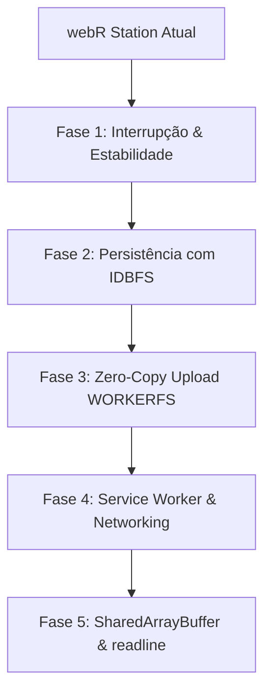

# 🗺️ Plano de Implementação — Recursos Avançados do webR

> **Status:** Planejado para implementação futura modular  
> **Objetivo:** Integrar os recursos avançados nativos do compilador e runtime **webR** (v0.3.x / v0.5.x+) para elevar a estabilidade, performance de I/O, persistência e experiência interativa do **webR Station**.

---

## 📋 Visão Geral das Etapas de Implementação



---

## 🥇 Fase 1: Interrupção em Tempo Real (`webR.interrupt()`) & Gestão de Memória (`RObject.destroy()`)

> **Prioridade:** 🔴 Alta | **Esforço:** 🟢 Baixo | **Risco:** 🟢 Baixo

### 1.1. Botão de Emergência "Interromper Execução"
- **Objetivo:** Permitir ao usuário abortar loops infinitos (`while(TRUE)`) ou cálculos pesados sem precisar fechar ou recarregar a aba do navegador.
- **Implementação:**
  - Adicionar botão `<button id="btn-interrupt-r" class="btn btn-danger btn-sm"><i class="bi bi-stop-circle-fill"></i> Interromper</button>` na barra de execução e no cabeçalho do Console.
  - Vincular evento de clique e atalho de teclado global (<kbd>Ctrl</kbd>+<kbd>C</kbd> ou <kbd>Esc</kbd> durante execução ativa).
  - Chamada ao método nativo: `await webR.interrupt()`.
  - Tratamento de interface: redefinir o cursor/spinner de carregamento, emitir aviso no console (`[Interrompido pelo usuário]`) e liberar o prompt.

### 1.2. Desalocação Explícita de Objetos WebAssembly (`RObject.destroy()`)
- **Objetivo:** Prevenir vazamento de memória (*memory leaks*) no heap do WebAssembly durante sessões prolongadas.
- **Implementação:**
  - Em [`config/webr-analysis.js`](file:///c:/Users/lukzb/Projects/webr/config/webr-analysis.js), [`config/webr-unpack.js`](file:///c:/Users/lukzb/Projects/webr/config/webr-unpack.js) e nos inspetores de ambiente, encapsular conversões em blocos `try / finally`:
    ```javascript
    const robj = await webR.evalR(expr);
    try {
      const data = await robj.toJs();
      return data;
    } finally {
      if (robj && typeof robj.destroy === 'function') {
        robj.destroy();
      }
    }
    ```

---

## 🥈 Fase 2: Persistência Local no Navegador com `IDBFS` (IndexedDB)

> **Prioridade:** 🟡 Alta | **Esforço:** 🟡 Médio | **Risco:** 🟢 Baixo

### 2.1. Montagem do Diretório Persistente
- **Objetivo:** Garantir que arquivos enviados pelo usuário, datasets gerados no R e scripts não sejam perdidos ao recarregar a página (<kbd>F5</kbd>).
- **Implementação:**
  - No módulo [`config/webr-workstation.js`](file:///c:/Users/lukzb/Projects/webr/config/webr-workstation.js), durante o bootstrap do webR:
    ```javascript
    const PERSIST_DIR = '/home/web_user/workspace';
    await webR.FS.mkdir(PERSIST_DIR);
    await webR.FS.mount('IDBFS', {}, PERSIST_DIR);
    // Sincroniza dados do IndexedDB para a memória do R no início da sessão:
    await webR.FS.syncfs(true);
    ```
  - Criar helper de sincronização automática após escritas (`webR.FS.syncfs(false)`).

### 2.2. Indicador Visual de Persistência na UI
- Adicionar badge sutil na barra inferior/header: `💾 Workspace sincronizado no navegador`.
- Botão "Limpar Armazenamento Local" nas opções do sistema caso o usuário queira resetar o workspace.

---

## 🥉 Fase 3: Upload de Arquivos Grandes com `WORKERFS` (Zero-Copy)

> **Prioridade:** 🔵 Média | **Esforço:** 🟡 Médio | **Risco:** 🟢 Baixo

### 3.1. Estratégia Híbrida de Upload
- **Objetivo:** Permitir carregar bases de dados pesadas (> 50 MB / centenas de milhares de linhas) sem congelar a thread da interface e sem duplicar memória em arrays JavaScript.
- **Implementação:**
  - Arquivos pequenos (< 20 MB): gravados normalmente em `/home/web_user/uploads/` via `writeFile` / `IDBFS`.
  - Arquivos grandes (≥ 20 MB): montados diretamente via driver `WORKERFS` em `/mnt/files/`:
    ```javascript
    await webR.FS.mkdir('/mnt/files');
    await webR.FS.mount('WORKERFS', {
      files: [fileObject]
    }, '/mnt/files');
    ```
  - O R passa a acessar diretamente via `read.csv("/mnt/files/arquivo_gigante.csv")` com consumo de RAM quase nulo no JavaScript.

---

## 🏅 Fase 4: Conectividade e Requisições de Rede no R via Service Worker

> **Prioridade:** 🔵 Média | **Esforço:** 🔴 Alto | **Risco:** 🟡 Médio

### 4.1. Registro do Service Worker de Rede
- **Objetivo:** Viabilizar chamadas R padrão de download e consulta web direta (`download.file()`, `read.csv("https://...")` e pacotes como `httr`/`curl`).
- **Implementação:**
  - Criar o script `webr-serviceworker.js` na raiz do projeto.
  - Registrar o Service Worker no carregamento do `index.html`:
    ```javascript
    if ('serviceWorker' in navigator) {
      navigator.serviceWorker.register('./webr-serviceworker.js');
    }
    ```
  - Configurar canal de comunicação assíncrona entre o WebAssembly e o Service Worker para interceptar chamadas de rede e despachá-las com `fetch()`.

---

## 🎖️ Fase 5: Execução Síncrona com `SharedArrayBuffer` & Prompts `readline()`

> **Prioridade:** ⚪ Futura / Educacional | **Esforço:** 🔴 Alto | **Risco:** 🟡 Médio

### 5.1. Ativação de Cabeçalhos de Isolamento de Origem (COOP / COEP)
- Para utilizar `SharedArrayBuffer` no navegador, é necessário configurar:
  - `Cross-Origin-Opener-Policy: same-origin`
  - `Cross-Origin-Embedder-Policy: require-corp`
- No GitHub Pages estático, utilizar a técnica de Service Worker shim (`coi-serviceworker`) para emular os cabeçalhos.

### 5.2. Suporte a Entradas Interativas (`readline()` no R)
- Quando o código R invocar `readline("Digite o valor: ")`, o webR pausa a thread do worker e emite evento para a UI.
- A interface abre um prompt inline no Console ou modal elegante para o usuário digitar a resposta e continuar o script.

---

## 📊 Matriz de Priorização e Cronograma Sugerido

| Fase | Funcionalidade | Dependências | Complexidade |
| :--- | :--- | :--- | :--- |
| **Fase 1** | `webR.interrupt()` e `RObject.destroy()` | Nenhuma (nativo na API webR) | 🟢 1 a 2 dias |
| **Fase 2** | Persistência `IDBFS` (IndexedDB) | Nenhuma (nativo no Emscripten VFS) | 🟡 2 a 3 dias |
| **Fase 3** | Zero-Copy Upload `WORKERFS` | Nenhuma (Web Worker Filesystem) | 🟡 2 dias |
| **Fase 4** | Service Worker para `download.file()` | Suporte a Service Worker e HTTPS | 🔴 3 a 5 dias |
| **Fase 5** | `SharedArrayBuffer` & `readline()` | Cabeçalhos COOP/COEP / Service Worker | 🔴 4 a 6 dias |
